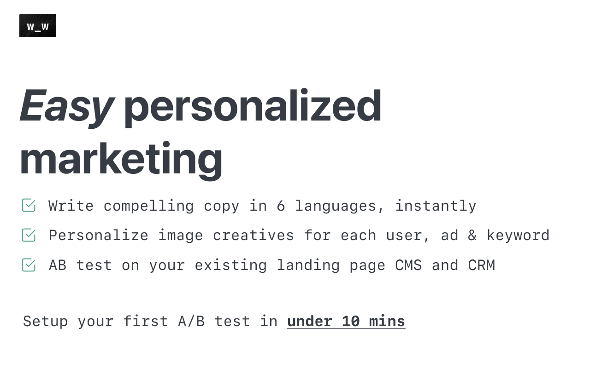

# Chrome extension for [wafrow](https://wafrow.com)

## Wafrow is an AI copywriter continuously AB testing landing pages
Small firms operating in multiple languages struggle to write great copy in all languages. Wafrow is trained on the best ecommerce sites in english, Deutsch, العربية, français, español and Nederlands to continuously increase the last bip of conversion rate, while you sleep.

## Wafrow chrome extension is used to configure new experiments
The chrome extension helps admin users select elements on their website which they'd like to experiment on, create variants, set rollout conditions and launch new experiments

Given how much we benefit from open source, we're committed to giving back and this is our first contribution to the cause. We'll keep adding more of our repositories to this soon.